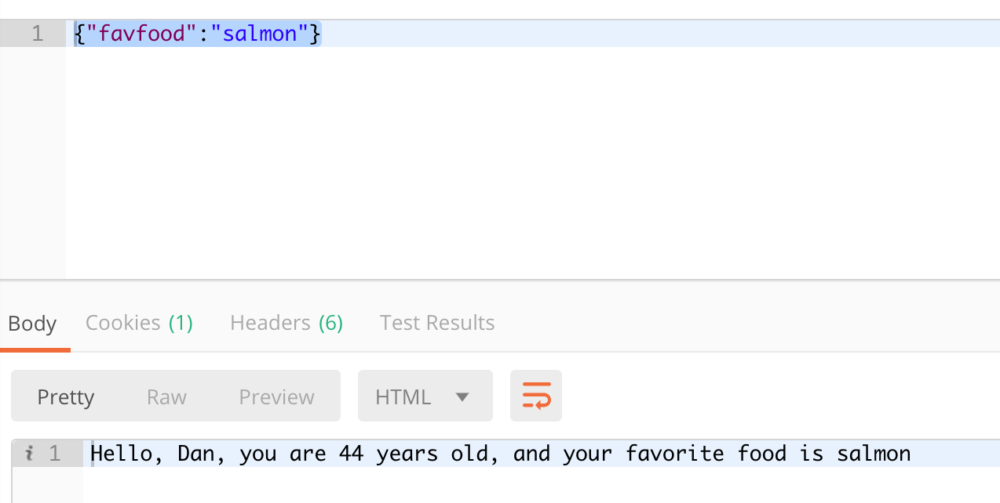

# PHP php receiving data

Introduction to PHP code - multi-tables

### Before you begin

Check out a new branch from master for this exercise.  Then navigate to exercises/php_multi_tables directory in your terminal.
#### make a new branch named the same thing as the folder

### Exercise

#### json subdata
1. take the file mysqldump_json.sql and import it into your cohort database
1. make a file, getData1.php
1. make a connection to your database, include that connection in your getData1.php file
1. if you need to make and include any support functions you need in functions.php and include the file
1. write a query that selects all data from the multitable_json table
1. get the data from the query through php mysqli functions
1. make an output variable as an array
1. each row has releaseData, which has json in it.
    * decode the json,
    * readd it to the row
    * add the row to the output
1. json encode the output
1. print the output
    * OUTPUT

#### multi-table join readd
1. Read about [** MySQL join**](https://dev.mysql.com/doc/refman/8.0/en/join.html)
1. Read about [** MySQL AS (alias)**](https://www.w3schools.com/sql/sql_alias.asp)
1. take the file mysqldump_multitable.sql and import it into your cohort database
1. make a file, getData2.php, and connect to your database and extra files like in getData1.php
1. select all records from multitable_meta, joining in the multitable_subtable rows that match your multitable_meta data (the id from multtable_meta matches your miltitable_subtable multitable_metaID)
    * get the following fields
        * multitable_meta:
            * id
            * title
            * director
            * totalGross
            * releaseDate as originalReleaseDate
            * stage
        * multitable_subtable:
            * market, 
            * releaseDate,
            * gross, 
            * status
1. in your while loop
    1. get the ID from the $row
    1. check if the ID you got exists as a key in $output
    1. if it does not have that id
        * add a new key, releaseData, as an empty array, to row
        * add the row to the output
    1. if it does have that id already
        * put the row's market, gross, releaseDate, and status to a new array
        * push the new array into the releaseData key in the current ID output
1. encode and print out your data as normal
1. OUTPUT
1. extra: make a file, getData3, that instead of using the above method, uses the group by and group concat functions instead

1. test your endpoint
    * 
1. make a pull request with the current version.  Don't forget to include your screen shots.