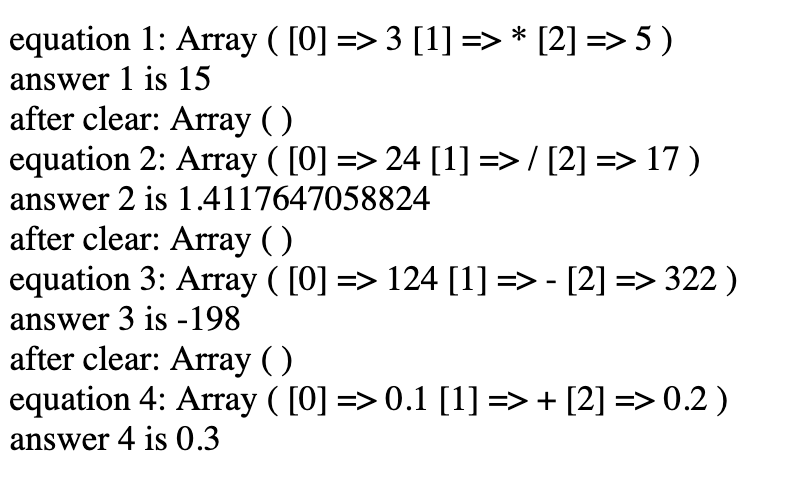

# PHP php receiving data

Introduction to PHP code - oop calc server

### Before you begin

Check out a new branch from master for this exercise.  Then navigate to exercises/php_oop_calc_server directory in your terminal.
#### make a new branch named the same thing as the folder

### Exercise

1. make a class CalculationServer with the following methods / properties
    - properties:
        - private:
            - equation: an array
            - equationLength: an int 0
    - methods:
        - private:
            - canAddOperator
                - params: none
                - return: true if we can currently add an operator to the equation
            - doMath
                - purpose: 
                    - calculate the result of 2 numbers and op passed in
                - params: 
                    - float first operand
                    - string operator
                    - float second operand
                - return: 
                    - returns the result of the given math equation
            - pushOp
                - purpose:
                    - add an op to the storage equation, and increase the length by 1 or if there is already an op, replaces it
                - params:
                    - the param to add
                - return:
                    - none
        - public:
            - clear
                - purpose:
                    - clear the array and reset the counter to 0
                - params:
                    - none
                - return: 
                    - none
            - getEquation
                - purpose:
                    - return the equation currently stored
                - params:
                    - none
                - return: 
                    - array
            - calculate
                - purpose:
                    - check if there is enough to perform math (must be some multiple of 3 items, must have 3 or more items)
                    - passes numbers and operators to doMath, gets the result, substitutes it back into the array, and continues doing math until we reach a final result
                - params:
                    - none
                - returns:
                    - float: a final result
            - pushOperands
                - purpose:
                    - adds the passed in value to the equation and increases the length by 1
                    - if the current item is a number, concatenates onto the value in the equation
                - params:
                    - string the operator in question
                - returns:
                    - none
            - add:
                - purpose: 
                    - calls the pushOp function with a param of '+'
                - params: 
                    - none
                - returns:
                    - none
            - subtract:
                - purpose: 
                    - calls the pushOp function with a param of '-'
                - params: 
                    - none
                - returns:
                    - none
            - divide:
                - purpose: 
                    - calls the pushOp function with a param of '/'
                - params: 
                    - none
                - returns:
                    - none
            - multiply:
                - purpose: 
                    - calls the pushOp function with a param of '*'
                - params: 
                    - none
                - returns:
                    - none
1. run the following php code to test your code
```php
<?php 

$calc = new CalculationServer;

$calc->pushOperand(3);
$calc->multiply();
$calc->pushOperand(5);
print("<br>equation 1: ");
print_r($calc->getEquation());
$calc->calculate();
print("<br>answer 1 is ".$calc->getEquation()[0]);

$calc->clear();
print("<br>after clear: ");
print_r($calc->getEquation());
$calc->pushOperand(2);
$calc->pushOperand(4);
$calc->divide();
$calc->pushOperand(1);
$calc->pushOperand(7);
print("<br>equation 2: ");
print_r($calc->getEquation());
$calc->calculate();
print("<br>answer 2 is ".$calc->getEquation()[0]);

$calc->clear();
print("<br>after clear: ");
print_r($calc->getEquation());
$calc->pushOperand(12);
$calc->pushOperand(4);
$calc->subtract();
$calc->pushOperand(3);
$calc->pushOperand(22);
print("<br>equation 3: ");
print_r($calc->getEquation());
$calc->calculate();
print("<br>answer 3 is ".$calc->getEquation()[0]);

$calc->clear();
print("<br>after clear: ");
print_r($calc->getEquation());
$calc->pushOperand(.1);
$calc->add();
$calc->pushOperand(.2);
print("<br>equation 4: ");
print_r($calc->getEquation());
$calc->calculate();
print("<br>answer 4 is ".$calc->getEquation()[0]);
?>
```
1. it should have the following output

